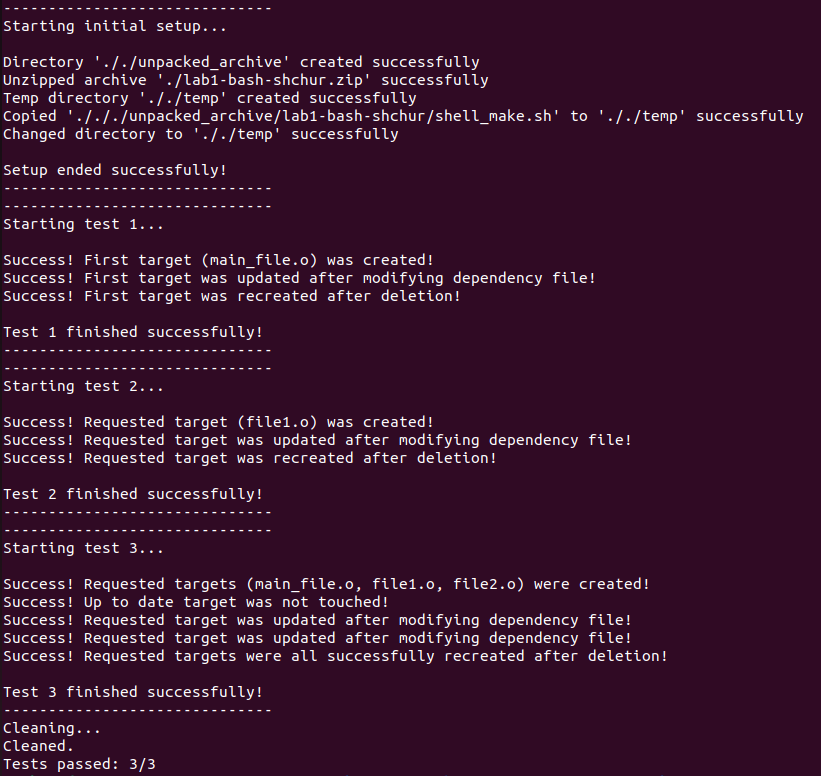

# Shmake autotests
The following script (shellmake_test.sh) purpose is to automate students' works testing 

## Usage 

    bash shellmake_test.sh <archive>

You will get logs and final report of total number of tests passed.

## Debugging

If you need more info, you can check log files generated, where all output of tested script is saved.

## Example

## Warning 

Some problems related to line endings are possible on different operating systems (\r\n), so be careful with that.