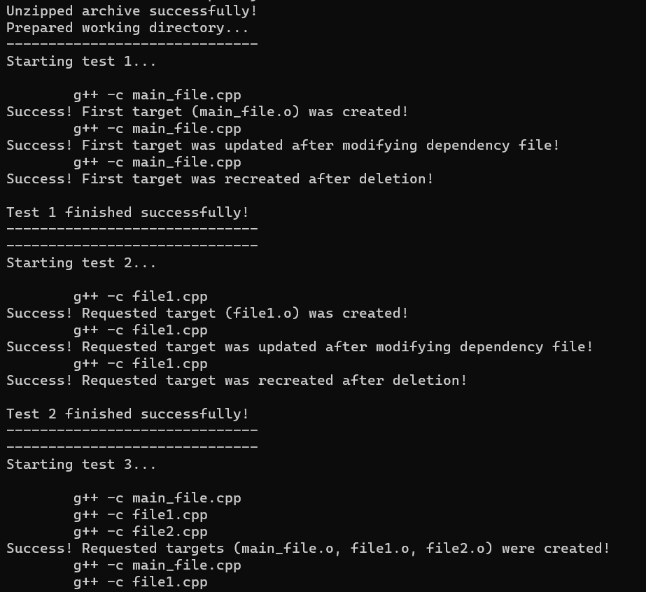
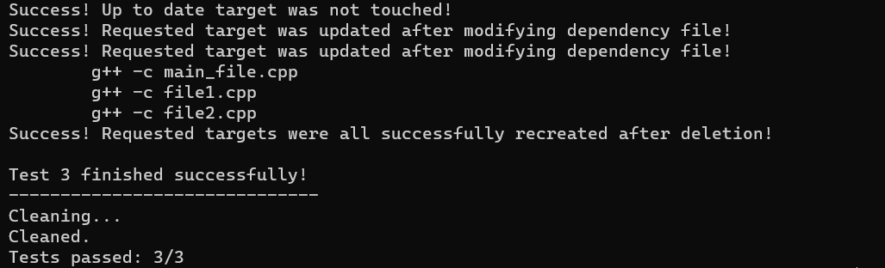

# Shmake autotests
The following script (shellmake_test.sh) purpose is to automate students' works testing 

## Usage 

    bash shellmake_test.sh <archive>

You will get logs and final report of total number of tests passed.

## Example

